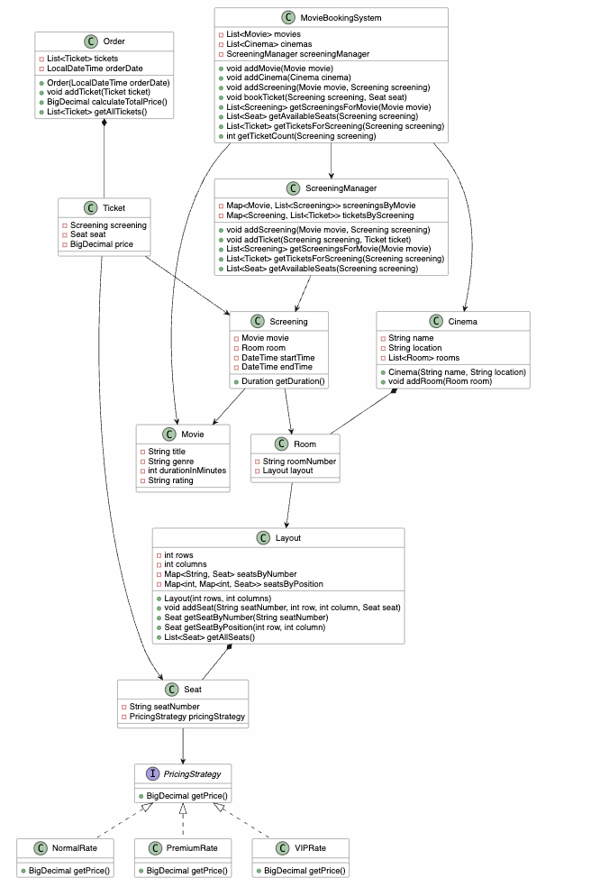

# Movie Ticket Booking System

This is a Java-based movie ticket booking system that allows users to manage cinemas, movies, screenings, and ticket bookings.

## Project Structure

```
movie_ticket/
├── MovieBookingSystem.java
├── MovieBookingSystemTest.java
├── location/
├── rate/
├── showing/
└── ticket/
```

## Class Diagram

The diagram source is [`movie_ticket_system.plantuml`](movie_ticket_system.plantuml) in this directory.

To render it, open [PlantUML](https://plantuml.com/) and paste the file into the online editor. The diagram updates in the browser.

A rendered copy is already saved at [`movie-ticket-class-diagram.png`](../movie-ticket-class-diagram.png):



## Running the Tests

```bash
# From this movie_ticket directory (the one that contains build.gradle)
gradle test
```

### What the Tests Cover

The test suite (`MovieBookingSystemTest.java`) verifies the core functionality of the booking system:

- Creating a cinema with rooms and seating layouts
- Adding movies and screenings
- Managing seat availability
- Booking tickets
- Verifying ticket prices

### Test Output

A successful test run prints the walkthrough from `MovieBookingSystemTest`, then `BUILD SUCCESSFUL`:

```
MovieBookingSystemTest > testBrowseAndBuy() STANDARD_OUT

    === Testing Movie Booking System: Browse and Buy Flow ===

    --- Creating Room and Setting Up Seat Pricing ---
    ✓ Created room '1' with 10x10 seats, each seat priced at $10.00
    ...
    === Movie Booking System Test Completed Successfully ===

BUILD SUCCESSFUL
```

## Attribution

This example is adapted from the Movie Ticket Booking example
in ByteByteGo's Object-Oriented Design Interview materials.

Original source:
ByteByteGoHQ/ood-interview

The repository is used here for educational discussion in Coding Gym.
